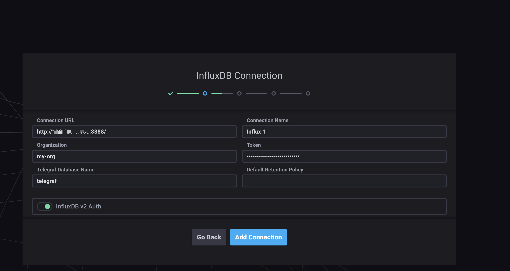

# Chronograf 安装
```
mkdir /home/influx/chronograf
docker run -d --name chronograf -p 8888:8888 \
       -v /home/influx/chronograf:/var/lib/chronograf \
       chronograf
```

### 浏览器打开 http://[ip]:8888
按提示填写,连接到influxdb


[下一个：Kapacitor  安装](https://github.com/deanls1/note/blob/main/influxdb/4.Kapacitor%20%E5%AE%89%E8%A3%85.md)
