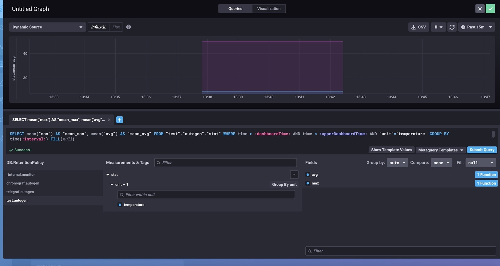

# 使用 influxdb 进行业务监控

### 1.使用golang编程，向influxdb 存入业务数据

#### example

```
package main

import (
	"context"
	"fmt"
	"time"

	"github.com/influxdata/influxdb-client-go/v2"
)

func main() {
	userName := "admin"
	password := "admin123"
	// Create a new client using an InfluxDB server base URL and an authentication token
	// For authentication token supply a string in the form: "username:password" as a token. Set empty value for an unauthenticated server
	client := influxdb2.NewClient("http://192.168.1.158:8086", fmt.Sprintf("%s:%s", userName, password))
	// Get the blocking write client
	// Supply a string in the form database/retention-policy as a bucket. Skip retention policy for the default one, use just a database name (without the slash character)
	// Org name is not used
	writeAPI := client.WriteAPIBlocking("", "test/autogen")
	// create point using full params constructor
	p := influxdb2.NewPoint("stat",
		map[string]string{"unit": "temperature"},
		map[string]interface{}{"avg": 24.5, "max": 45},
		time.Now())
	// Write data
	err := writeAPI.WritePoint(context.Background(), p)
	if err != nil {
		fmt.Printf("Write error: %s\n", err.Error())
	}

	// Get query client. Org name is not used
	queryAPI := client.QueryAPI("")
	// Supply string in a form database/retention-policy as a bucket. Skip retention policy for the default one, use just a database name (without the slash character)
	result, err := queryAPI.Query(context.Background(), `from(bucket:"test")|> range(start: -1h) |> filter(fn: (r) => r._measurement == "stat")`)
	if err == nil {
		for result.Next() {
			if result.TableChanged() {
				fmt.Printf("table: %s\n", result.TableMetadata().String())
			}
			fmt.Printf("row: %s\n", result.Record().String())
		}
		if result.Err() != nil {
			fmt.Printf("Query error: %s\n", result.Err().Error())
		}
	} else {
		fmt.Printf("Query error: %s\n", err.Error())
	}
	// Close client
	client.Close()
}

```

### 2.在chronograf web ui 界面中 配置仪表

#### example


